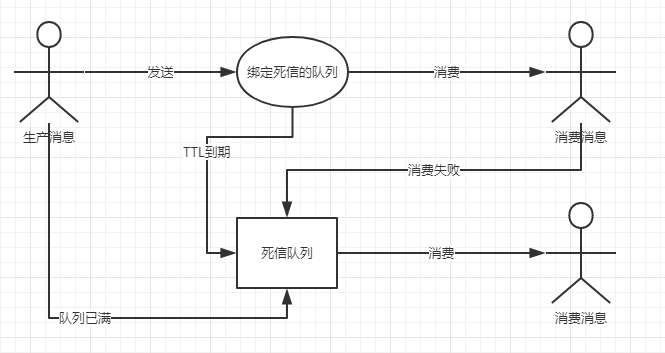

# rabbitmq-examples
## rabbitmq 示例  -笔记整理

### 一、消息确认机制
[示例代码-暂未开放]()

### 二、消息重试机制
[示例代码-暂未开放]()
#### 1.消费者在消费消息的时候，如果消费者业务逻辑出现程序异常，这时候应该如何处理？

    答案：使用消息重试机制。(代码演示-SpringBoot整合通配符模式与消息重试机制)

#### 2.重试机制方式
*  消费方异常抛出
*   
#### 3.如何合适选择重试机制:
  情况1:  消费者获取到消息后，调用第三方接口，但接口暂时无法访问（网络延迟），是否需要重试?  （需要重试机制）
  情况2:  消费者获取到消息后，抛出数据转换异常，是否需要重试?（不需要重试机制）需要发布进行解决。
  
  如何实现重试机制
  总结：对于情况2，如果消费者代码抛出异常是需要发布新版本才能解决的问题，那么不需要重试，重试也无济于事。应该采用日志记录、人工进行补偿、消息拒绝策略（死信队列）。

### 三、消息幂等性
[示例代码-暂未开放]()

### 四、死信队列
[示例代码-暂未开放]()

死信队列作用：用来保存处理失败或者过期的消息，确保消息不被丢失以便排查问题！

#### 1.死信队列设计思路

生产者 --> 消息 --> 交换机 --> 队列 --> 变成死信 --> DLX交换机 -->队列 --> 消费者

进入消息队列（代码演示-SpringBoot整合发布/订阅模式与如下三种死信队列)：
1. 消息被拒绝，并且requeue= false
2. 消息ttl过期
3. 队列达到最大的长度

### 五、分布式事务思路
[示例代码-暂未开放]()

### 六、自定义重试机制+死信队列
[示例代码-暂未开放]()